# dsh-pet（本仓库分支说明）

> **本仓库**在上游 [PC2005-cloud/dsh-pet](https://github.com/PC2005-cloud/dsh-pet) 基础上增加了：
>
> - **全局打字互动**（类似直播伴侣：系统按键时宠物播打字动画）
> - **岁纳京子 pet pack**（`kyoko-pack/` + `prompts/kyoko/`）
>
> 使用前请阅读：**[NOTICE.md](NOTICE.md)**（上游归属）· **[DISCLAIMER.md](DISCLAIMER.md)**（同人素材 / 禁止商用）· **[LICENSE](LICENSE)**（代码 MIT）· **[CHANGES.md](CHANGES.md)**（做了什么）· **[CONTRIBUTING.md](CONTRIBUTING.md)**
>
> 京子相关内容为《摇曳百合》角色的**非官方同人二次创作**，与官方无关，**禁止商用**。

### 京子包快速启用

```sh
# 已安装 dsh-pet 插件后，将包拷到 DSH 用户目录：
#   %USERPROFILE%\.dsh\dsh-pet\pet\kyoko-config.json
#   %USERPROFILE%\.dsh\dsh-pet\pet\kyoko-animation\*.webm
# 然后重启：dsh web
```

打字互动：在对应宠物配置中设 `"typingEnabled": true`，并配置 `animations.events.typing`。

---

# dsh-pet 🐾

<p align="center">
  <a href="https://www.npmjs.com/package/dsh-pet"></a>
  <a href="https://www.npmjs.com/package/dsh-pet"></a>
  <a href="https://www.npmjs.com/package/dsh-pet"></a>
  <a href="https://github.com/PC2005-cloud/dsh-pet"></a>
  <a href="https://github.com/PC2005-cloud/dsh-pet/blob/master/LICENSE"></a>
  <a href="https://awesome-dsh-plugin.com"></a>
  <a href="https://github.com/PC2005-cloud/dsh-pet"></a>
  <a href="https://github.com/PC2005-cloud/dsh-pet/issues"></a>
  
  
</p>

一只住在 [DeepSeek Harness](https://github.com/deepseek-ai/deepseek-harness) 里的桌面宠物：待机呼吸、随机动作（打瞌睡、玩魔方、写代码、吃火锅……97 个手绘风透明动画随时无缝衔接）、左右转向、屏幕漫游、点击 Q 弹、拖拽甩抛反弹、右键菜单点播动作、余额动画 + 头顶联想气泡——可多开同屏，能脱离浏览器住上**桌面**（透明置顶小窗），也能自己添加**全新宠物种类**（pet pack）。

这不是一个普通插件，而是**完整的三件套项目**：

```
① 提示词（配方）    →  ② 素材生成链（引擎）  →  ③ 插件（成品）
AI 生成动画的配方     源视频 → 透明动画的管线    运行在 DSH 里的宠物
```

任何人 clone 本仓库，都可以**从零生成自己的桌面宠物**——换角色、换动作、换风格，全流程可复现。

---

## 快速开始（安装插件）

> 以下命令都在你的**命令行终端**（PowerShell / CMD 等）中运行。前提是 DSH 环境已就绪：

```sh
# ① 前置要求：确认 Node.js 已安装
node -v

# ② 安装 DSH 启动器与 pnpm（已装可跳过；装完请重新打开终端）
npm install -g @deepseek-ai/dsh pnpm
dsh --version   # 验证 dsh 命令可用

# ③ 安装本插件
dsh plugin --profile web add dsh-pet
```

重启 `dsh web`，宠物出现在界面右上角（默认配置角落，可在设置页修改）。

> **兼容性**：本插件在 dsh **`0.1.1-rc.2`** 下开发并测试（`dsh --version` 可查看你的版本）。建议使用相同版本；其他版本如遇问题欢迎反馈。

### 从源码安装（clone 本仓库后）

`lib/` 构建产物不入库，clone 后需要先构建再安装：

```sh
# ① clone 本仓库，进入插件目录
git clone https://github.com/PC2005-cloud/dsh-pet.git
cd dsh-pet/dsh-pet

# ② 安装依赖
npm install

# ③ 构建（tsdown → lib）
npm run prepare     # 构建完整 lib（npm install / npm publish 时会自动执行）

# ④ 安装到 DSH（file: 指向本目录，用构建好的 lib）
dsh plugin --profile web add file:D:/path/to/dsh-pet
```

> 注：`prepare`（npm install / npm publish 时自动执行，也可手动 `npm run prepare`）才产出**完整可安装**的 lib——除 tsdown 构建外还构建桌面共享核心（`shared-core.js`）、生成类型声明并收敛发布 `files` 清单；裸 `tsdown` 构建会缺桌面运行时与类型。

## 插件功能

- **纯粹的桌宠**：核心就是陪你——没有天气查询、系统监控、Agent 状态感知等花活；除了**可选的余额展示**（见下节）与**系统通知**（对话完成 / 生成失败 / 输出截断 / 权限申请 / 用户选择，窗口失焦时弹系统级通知）外没有其他业务功能。零核心改动（不碰 DSH 内核）
- **余额展示**：实时显示当前 LLM 服务商的余额/额度——DeepSeek 官方显示账户余额（¥），OpenCode Zen Go 显示 5h/周/月 三个额度窗口中最紧张的一个；每次刷新按档位播放余额动画，头顶弹出联想气泡（随宠物大小等比缩放，10 秒后自动消失）；每只宠物可独立开关（`balanceEnabled`）
- **动画链**：每个动画（含待机）播完立即按权重选下一个（权重配置于 `config.jsonc`，默认 idle 10 / turn 5 / move 5 + 动作分类权重），首尾相接永不停止
- **多开**：可配置同时显示多个宠物，每只宠物独立的大小与位置（设置页「桌宠配置」添加/删除）
- **屏幕漫游**：朝 facing 方向行走，先检查空间、不走出屏幕
- **点击/拖拽（弹簧跟手 + 甩抛反弹 + Q 弹）**：点击有回应动画并「Q 弹」挤压回弹（贴地锚定，reduce-motion 跳过）；拖拽为过阻尼弹簧跟手，用力甩出会沿抛物线飞行、屏幕边缘反弹、落地摩擦停稳且**每次落地 Q 弹一下**（温柔放下 = 原地停住），两端同一套纯函数物理与挤压曲线（`dsh-pet/src/shared/physics.ts`）
- **右键菜单**：右键宠物弹出级联菜单——桌面端根项为「**打开网站 / 查看余额 / 回到初始位置** + **动作**」、浏览器端为「**回到初始位置** + 动作」；「打开网站」用系统默认浏览器打开 DSH 网站（等效网页里 Ctrl+点击链接）；「查看余额」立即弹余额气泡播档位动画（桌面端；浏览器端用对话框 `/balance` 命令）；动作 → **分类** → **具体动画**，可任意点播（**移动**分类动画点播会真实行走一段——边界检查/随机距离/起停时段与随机移动同一套）；同一份组件两端共用、外观行为一致
- **左右朝向**：所有动画可镜像，人物可朝左/朝右
- **落地对齐**：动画统一脚底线，宠物始终站在地面上
- **流畅切换**：双缓冲交叉淡入，切换无空白帧
- **桌面模式（可选）**：可脱离浏览器，为每只桌面宠物开一个独立透明置顶局部小窗，与浏览器严格同行为、共用同一份素材与纯逻辑（见下节）
- **额外宠物种类（pet pack）**：在 `$DSH_HOME/dsh-pet/pet/` 下建 `种类名-config.json` + `种类名-animation/`，即可添加拥有**独立动画池与素材**的全新种类，多实例共享素材（见「配置 → 方式四」）
- **自定义动画**：往 `main-animation/webm/` 放入 VP9-Alpha 的 `.webm` 即可作为新动画，优先于包内素材
- **无障碍**：支持 `prefers-reduced-motion`（减少动效时跳过 Q 弹挤压与淡入切换）

## 🪟 桌面模式（可选，脱离浏览器）

插件内建**双模式**：安装后默认会拉起**独立透明置顶窗口**——为每只桌面宠物各开一个**局部小窗口**（尺寸 = 宠物包围盒 + 四周外扩余量，为气泡/弹窗预留空间，跟随宠物移动；**永不铺满屏幕**：全屏透明分层窗会触发 Windows DWM 视频合成黑屏）。与浏览器 overlay **严格同行为**——同一份纯逻辑源码（`dsh-pet/src/shared/`），两端的功能/动画/文案/配置完全对齐，不会出现"一个有另一个没有"：

- **依赖**：首次启动自动探测 Electron（`DSH_PET_ELECTRON_PATH` 环境变量 → 全局 npm → 常见安装位置），找不到时自动下载到 `~/.dsh/electron/`（可 `cd dsh-pet && npm run ensure:electron` 手动触发）；缺失时仅日志告警，不影响浏览器形态
- **开关 = 每只宠物的必填字段 `display`**（四个值）：`web` = 仅浏览器 / `desktop` = 仅桌面 / `both` = 两者 / `none` = 都不显示；桌面模式渲染 display 含 desktop 的**全部**宠物（多开同屏，与浏览器一致）。在 DSH 设置页「桌宠配置」编辑，保存即时生效；缺失即配置错误，代码不做兜底
- **实现**：浏览器 bundle 与桌面 `shared-core.js`（`src/shared` 的 iife 构建产物，`window.PetShared`）共用同一份纯逻辑；桌面端 `dsh-pet/runtime/electron-helper/` 只是薄壳（Electron 窗口 + 纯 DOM 渲染），行为差异为零
- **数据通道（bridge）**：桌面 Helper 是插件自拉的独立 Electron 进程，宿主与它之间走**进程管道 + 本地回调**（`dsh-pet-bridge://` 自定义 scheme → Electron 主进程 → stdout JSON 行 → 宿主 `handlePetRoute` 应答，素材只传文件路径由 Helper 读盘）——桌面端**不依赖 DSH 的 HTTP 路由**，因此不受 DSH Desktop 2.0.3+ 浏览器访问闸门影响（该闸门只放行带内部令牌的请求，插件子进程的裸 HTTP 会被 403）。`start:desktop` 本地调试/无宿主场景自动回落旧 HTTP 路径
- 本地调试：`cd dsh-pet && npm run start:desktop -- http://127.0.0.1:3080/dsh-pet-7340/config`（无 `DSH_PET_BRIDGE`，走 HTTP）

## ⚙️ 余额展示（Balance）

余额是"事件动画"的一种：运行时按 `eventsRefreshSec.balance`（秒）周期拉取当前服务商（跟随 `agent-default-model` 的 provider）的余额/用量数据，每次刷新按档位触发一次余额动画，并在宠物头顶弹出**联想气泡**（气泡为角色"思考"式白泡，随宠物大小等比缩放，10 秒后自动消失）：

- **DeepSeek 官方（`deepseek-official`）**：气泡显示账户余额（如 `余额 ¥8.79`）；余额按 ¥20 满额折算成已用百分比，分 6 档播放动画（钱袋满溢 → 金袋叮当 → 钱袋如常 → 数金皱眉 → 袋空如洗 → 分文不剩）
- **OpenCode Zen Go（`opencode-go`）**：气泡显示 5h/周/月 三个额度窗口中最先告急的一个（如 `周额度已用 88%` / `2.5 天重置`），同样按已用百分比分档
- **按宠物开关**：`pets[i].balanceEnabled`（必填布尔）控制该宠物是否触发余额动画/显示气泡；全部宠物关闭时自动跳过余额轮询
- **所需凭据**：对应 provider 的 API key（`deepseek-official` → `DEEPSEEK_API_KEY`；`opencode-go` → `OPENCODE_GO_API_KEY`），在 DSH 凭据中配置后启用；未匹配的服务商按设计不触发动画、不显示气泡

## ⚙️ 配置（大小 / 位置 / 多开）

桌宠的大小、位置、多开均可配置，两条途径：

> 💡 **两条途径只是编辑入口不同，最终都是同一份用户配置**——配置能力远不止设置页那几个选项：设置页可改大小/位置/边距/显示位置/余额开关/多开，但**手动编写配置文件可以任意自由配置**（动画池、播放权重、事件动画、刷新周期……），只要**格式与包内默认配置 `config.jsonc` 一致**即可，用户配置会**整体覆盖**对应字段的默认值。

### 方式一：设置页（推荐）

DSH 设置 → 「桌宠配置」：

- **大小**：宽度 px（高度自动 = 宽度 × 9/16）
- **位置**：四角（corner）＋ 水平/垂直边距（marginX / marginY）
- **显示位置**（display）：web=仅浏览器 / desktop=仅桌面 / both=两者都显示 / none=都不显示
- **余额功能**：勾选后该宠物才会触发余额动画并显示余额气泡
- **多开**：添加/删除宠物，每只宠物独立 id、大小、位置
- 点「保存」**即时生效**（无需刷新）；「恢复默认」回到 config.jsonc 默认

### 方式二：config.jsonc（单一来源）

插件包内 `dsh-pet/assets/config.jsonc` 的 `pets` 数组定义**默认宠物**：

```jsonc
"pets": [
  { "id": "main", "size": 462, "balanceEnabled": true, "display": "both", "position": { "corner": "top-right", "marginX": 24, "marginY": 100 } }
]
```

- 每只宠物：`id`（标识）／ `size`（宽度 px）／ `balanceEnabled`（是否启用余额功能，必填布尔）／ `display`（web/desktop/both/none，必填，见上）／ `position`（corner 四角之一 + marginX/marginY 边距）
- 余额刷新周期：`eventsRefreshSec.balance`（秒）——余额数据刷新与余额动画触发的间隔，启动时立即触发一次，之后按此周期循环（默认 1800）
- 设置页的修改保存到用户层 `$DSH_HOME/dsh-pet/main-config.json`（**完整宠物列表**，覆盖包内默认）；「恢复默认」即清除用户层、回落 config.jsonc

### 方式三：手动编辑配置文件（高级，任意自由配置）

用户层配置文件位于 `$DSH_HOME/dsh-pet/main-config.json`。**它和包内默认配置是同一套格式**——想改什么直接照着 `assets/config.jsonc` 的结构写即可，写错的字段/缺失的字段回落默认，无需（也无法）写完整份：

| 字段                   | 作用                                                                                    | 格式与默认一致即可         |
| ---------------------- | --------------------------------------------------------------------------------------- | -------------------------- |
| `pets`                 | 宠物列表（大小/位置/多开/余额开关）                                                     | 数组，每项同 `pets[]` 结构 |
| `animations`           | **动画池**：idle / turn / drag / clicks / moves / categories / events（余额等事件动画） | 同 `animations` 结构       |
| `animationWeights`     | 动画链播放权重（idle / turn / move）                                                    | 同 `animationWeights` 结构 |
| `eventsRefreshSec`     | 事件刷新周期（秒）                                                                      | 同 `eventsRefreshSec` 结构 |
| `notificationsEnabled` | 系统通知总开关（布尔）                                                                  | 同 `notificationsEnabled`  |

> 覆盖语义：用户层给出即**整体替换**该字段（如写了 `animations` 就用你的整份动画池，替代默认），没写的字段回落包内默认。校验在插件加载时执行——格式错误会在 DSH 控制台显式报错，不会静默运行残缺配置。

### 方式四：额外宠物（pet pack）——添加新「种类」

方式一~三都只调整**默认宠物的实例**（数量/大小/位置），动画池始终是全局一份。要添加**全新种类的宠物**（独立动画池 + 自己的素材），在用户数据根下建 `pet/` 目录：

```
$DSH_HOME/dsh-pet/
├─ main-config.json            ← 主宠物配置（现有，不动）
├─ main-animation/webm/*.webm  ← 主宠物素材（现有，只属于 main）
└─ pet/
   ├─ pig-config.json          ← 额外宠物 pig 的配置（命名词干 = 种类名，实例 id 任意）
   └─ pig-animation/*.webm     ← pig 自己的动画素材（直接平铺，仿 main-animation）
```

每只额外宠物 = 一个 `-config.json` + 一个 `-animation/` 目录，同前缀配对；扫描 `pet/` 自动发现，浏览器与桌面同时生效。一个 `-config.json` 定义**一个「种类」**（动画池 + 素材目录），`pets` 数组可放该种类的**任意多只实例**（共享动画池与素材）：

```jsonc
// pet/pig-config.json —— 与 main-config.json 同构的完整配置
{
  "notificationsEnabled": true,
  "pets": [
    {
      "id": "pig1",              // 实例 id（可多只；不必等于文件名前缀）
      "size": 420,
      "balanceEnabled": true,
      "display": "both",        // web / desktop / both / none
      "position": { "corner": "top-right", "marginX": 24, "marginY": 100 }
    },
    { "id": "pig2", "size": 360, "balanceEnabled": false, "display": "web", "position": { "corner": "top-left", "marginX": 24, "marginY": 100 } }
  ],
  "animations": {
    "idle": ["待机"], "turn": [], "drag": [], "clicks": ["打滚"],
    "moves": { "default": { "minDist": 80, "maxDist": 360, "margin": 20, "leadSec": 2, "tailSec": 2 }, "actions": [] },
    "categories": [],
    "events": { "balance": ["余额-钱袋满溢", "余额-金袋叮当", "余额-钱袋如常", "余额-数金皱眉", "余额-袋空如洗", "余额-分文不剩"] }
  },
  "animationWeights": { "idle": 80, "turn": 0, "move": 0 },
  "eventsRefreshSec": { "balance": 1800 }
}
```

规则（与主宠物**严格隔离**，绝不混用）：
- **素材只查自己的**：素材目录名 = 文件名前缀（`pet/pig-config.json` → `pet/pig-animation/`），该种类所有实例共用；动画 URL `/thumb/<前缀>/<名>.webm`，查不到即 404——绝不落到 `main-animation` 或包内素材
- **动画池不回落全局**：`animations` / `animationWeights` 必须写全（缺失即配置错误）
- 与主配置同构的约束：`pets` 每只字段完整合法、数组内 id 唯一、`animations` / `animationWeights` 结构校验同一套规则；`notificationsEnabled` / `eventsRefreshSec` 是全局属性，不归宠物文件管（写了忽略、不写不报错）
- 配置非法 / 缺少 `-animation/` 目录 / 实例 id 与主宠物冲突 → 加载时显式报错并跳过（不影响其他宠物）
- 设置页不列出文件宠物（改文件即生效，刷新可见；保存/恢复默认不会把它们写进 `main-config.json`）
- 余额档位动画按各宠物自己的 `events.balance`

## 运行效果

宠物实际运行在 DSH Web 界面中的样子：

<p>
  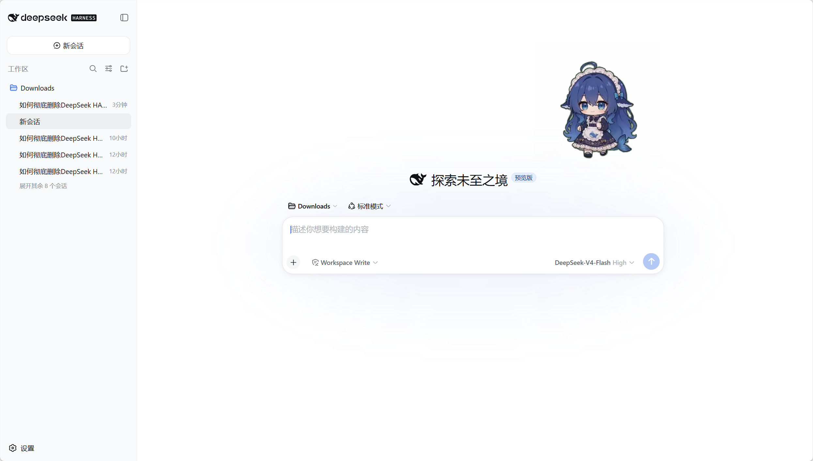
  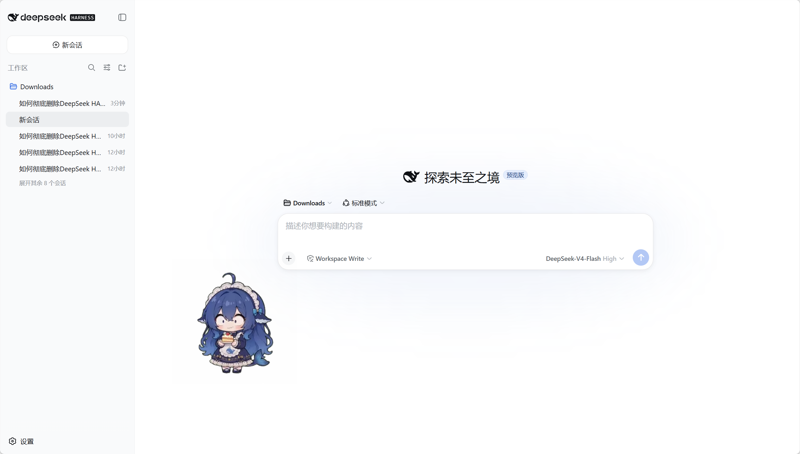
  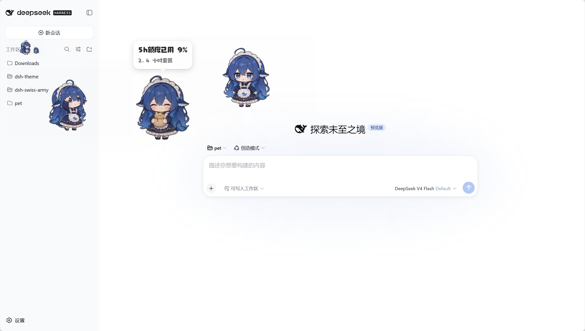
  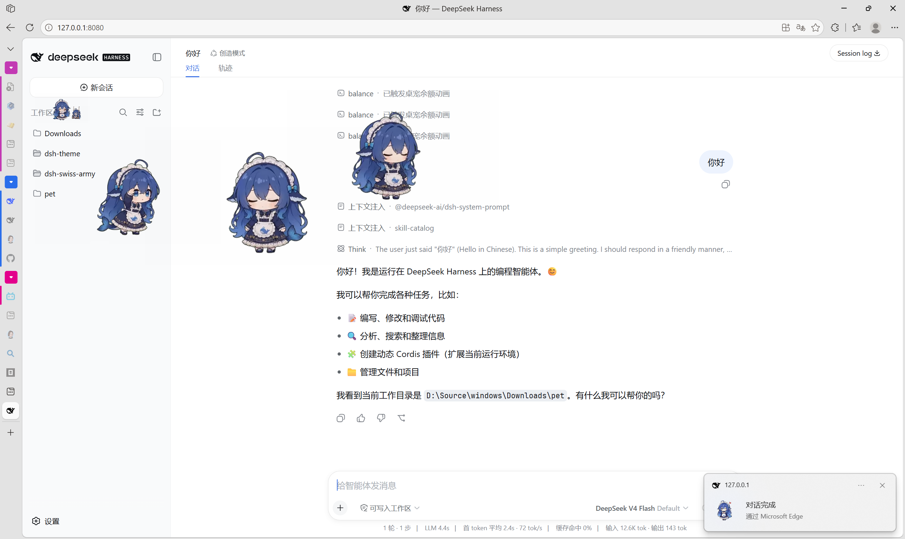
  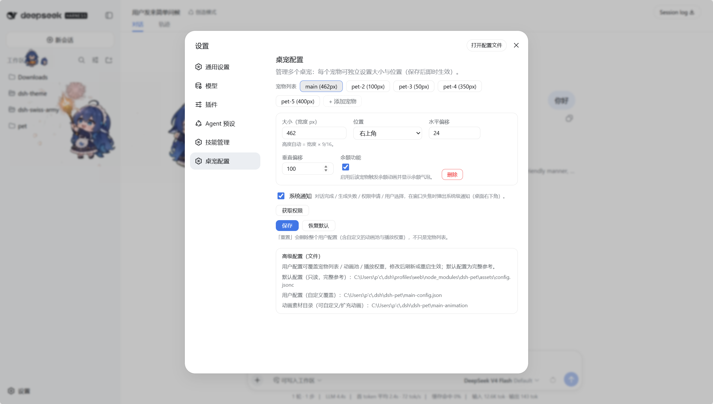
  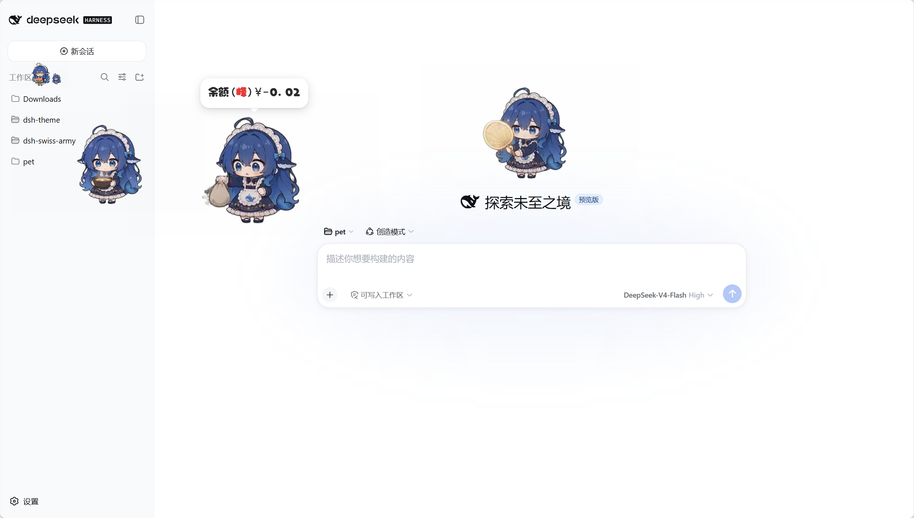
  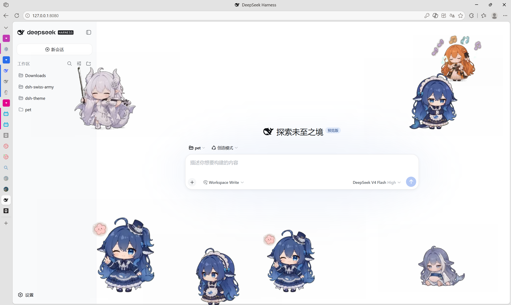
  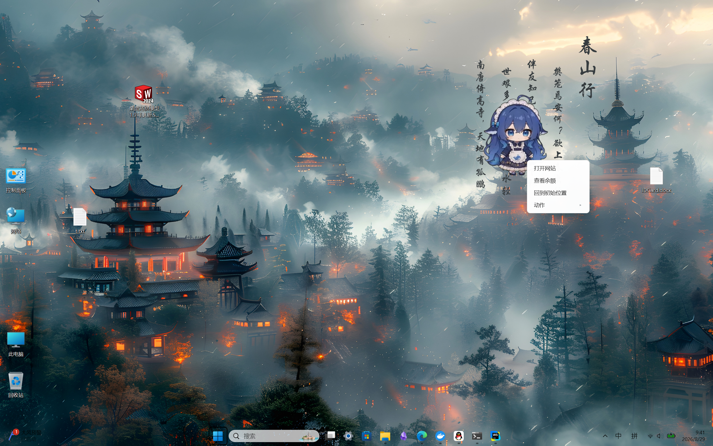
</p>

## 效果预览

全部动画（640×360，插件实际播放用的资源）——GIF 预览存放于仓库 `dsh-pet/assets/preview/`（raw 直链渲染，文件名采用拼音便于跨平台）；完整透明视频见插件包 `dsh-pet/assets/webm/`（VP9-alpha，唯一发布格式）：

**待机 / 转向**

<p>
  
  
</p>

**移动**

<p>
  
  
  
</p>

**小动作**

<p>
  
  
  
  
  
  
  
  
  
  
  
  
  
  
  
  
  
  
</p>

**玩耍**

<p>
  
  
  
  
  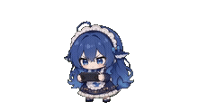
  
  
  
  
  
  
  
  
  
  
  
  
  
  
  
  
  
  
  
  
  
  
</p>

**吃什么**

<p>
  
  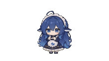
  
  
  
  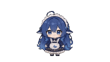
  
  
  
  
  
  
</p>

**时节**

<p>
  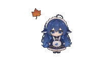
  
  
  
  
  
  
  
  
  
  
  
  
  
  
  
  
  
  
  
  
</p>

**文字**

<p>
  
  
</p>

**点击回应**

<p>
  
  
  
  
  
</p>

**拖拽**

<p>
  
</p>

**余额事件**（按余额已用百分比分档，满格 → 告急 → 耗尽）

<p>
  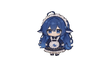
  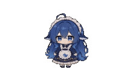
  
  
  
  
</p>

> 注：动画为透明背景；GIF 预览中透明部分显示为页面底色，实际 webm 播放为透明。

## 从零生成你自己的宠物（完整流程）

### ① 提示词 → 源视频

用 AI 视频生成工具（如可灵、Runway、豆包等，本项目素材即由豆包生成），按 `prompts/桌面宠物 10 秒动作提示词.md` 的配方，一个动作生成一段 10 秒绿幕视频：

- 视频比例 16:9，背景纯绿幕（#00FF00）
- 人物位置/大小固定（头顶 ~20% 高度、脚底 ~85% 高度）
- 动作全程在画幅内，首尾帧为标准正面站立
- 每段动画按秒分解（0-10s 各阶段动作）

生成结果按动作各存一个 mp4，放入 `video/`。

> **源视频获取**：为控制仓库体积，`video/` 源视频不入 git。Releases 提供**打包压缩包**，浏览器直接下载即可：
>
> - `assets-videos.zip` —— 全部源视频压缩包（中文名 mp4，解压后放入 `video/`）
>
> 解压：`Expand-Archive assets-videos.zip`（Windows）或 `unzip assets-videos.zip`，把 mp4 放回 `video/` 即可运行素材链。

### ② 源视频 → 透明动画（素材链）

step02（透明视频）有**两条路线，按需二选一**（默认自动、人人可复现；效果不佳可用 PR 手工抠像覆盖）：

```sh
cd scripts
# 路线 A（默认）：自动绿幕抠像（HSV 色相，无需人工）
python watermark_step01.py   # 水印遮罩填充 → step01/
python chroma_step02.py      # 绿幕抠像转透明 → step02/

# 路线 B（可选）：PR 手工抠像覆盖（针对含第三方物品/自动抠像效果不佳的动作）
#   1. 在 PR 里手工抠像，导出带 alpha 的透明 .mov（如 ProRes 4444 with Alpha）
#   2. 放入 pr/，文件名与动作名一致（如 吃白饭.mov）
python pr_import_step02.py   # pr/*.mov → step02/（透明 webm，覆盖该动作自动抠像结果）

# 后续步骤两条路线共用：
python normalize_step03.py   # 归一化 2160×1215 统一站立居中 → step03/
python encode_thumbs.py      # 转码 640×360 播放变体 → step04/
```

**依赖**：Python 3 + ffmpeg + numpy + scipy（素材链脚本自动用工作区 `.tools/` 下的 ffmpeg）。

> **本项目全部采用路线 B**（97 个动作均为 PR 手工抠像）：对"含第三方物品/透明边缘复杂"的动作，自动 HSV 抠像易残边或误抠，PR 手动遮罩更精细。两条路线产出同一级 `step02/`，后续步骤完全一致；`chroma_step02.py` 保留为自动化兜底，任何动作仍可一键自动生成。

### ②.5 🍎 Safari/HEVC 兼容流水线（保留，不参与发布，fork 定制用）

插件**只发布单一 webm 格式**（VP9-alpha）：浏览器 overlay 的 Chrome/Edge/Firefox 与桌面模式（Electron = Chromium）共用，无需第二套素材；**宿主端 thumb 路由不发布 `.mov`**（`dsh-pet/src/host/index.ts`）。Safari 不认 webm alpha（渲染黑底）、只支持 **HEVC-with-Alpha mov**（编码器 `hevcWithAlpha` 仅 macOS 有），需要 Safari 兼容者可 **fork 仓库自行启用**保留的流水线并自行加回 `.mov` 路由：

- workflow：`.github/workflows/hevc-alpha.yml`（手动触发 `workflow_dispatch`，macOS runner 云端批量转码）
- 编码脚本：`scripts/encode_hevc_alpha.sh`（ffmpeg 解码 webm → BGRA 帧管线 → Swift `hevc_alpha_encoder.swift` 走 AVAssetWriter `hevcWithAlpha` 原生 API）+ `scripts/check_alpha.py`（产物校验）
- 输入：`dsh-pet/assets/webm/*.webm`；输出写回 `dsh-pet/assets/mov/`（流水线输出目录，不入库不发布）；产物 `hvc1` tag + alpha 校验后打包为 artifact
- 启用方式：自行把 mov 素材同步进包并恢复双格式支持（`prepare.js` 已收敛为 webm、宿主 thumb 路由已移除 `.mov`，源码历史里都有 mov 分支可参考）

### ③ 动画 → 插件

```sh
# 把 step04 的播放变体同步进插件包（webm 直接 cp）
cp step04/*.webm dsh-pet/assets/webm/   # 播放格式（VP9-alpha）

# 本地安装插件
dsh plugin --profile web add file:D:/path/to/dsh-pet
```

> 中间产物（step01-04）由脚本生成、不入仓库；`video/` 源视频和脚本是成果、入库维护。

### 🎯 发布（单一 webm 格式）

插件只发布一个 npm 包、一个素材格式（webm）；`files` 收敛为固定清单（lib / src / assets/webm / runtime/electron-helper / assets/fonts / assets/pic / assets/config.jsonc / scripts/ensure-electron.mjs / cordis.patch.yml，见 `prepare.js`；浏览器与桌面模式共用，包体最小）：

```sh
cd dsh-pet
npm publish --tag latest   # npm publish 自动执行 prepare 钩子（构建完整产物 + 收敛 files），无需手动构建
```

- client 端不做运行时浏览器判断——唯一播放格式 webm 在源码写死，无发布期注入
- 需要 Safari/HEVC 版：见上方 ②.5，fork 仓库后启用保留的流水线自行定制

### 项目结构

```
├── prompts/                 # ① 各动作的生成提示词（绿幕规范 + 按秒分解）
├── step01/                  # ② 素材链中间产物：水印去除后的绿幕视频（不入库）
├── step02/                  # ② 素材链中间产物：抠像（不入库）
├── step03/                  # ② 素材链中间产物：归一化 2160×1215 统一站立居中（不入库）
├── step04/                  # ② 素材链中间产物：640×360 播放变体（不入库）
├── scripts/                 # ② 素材生成链（Python：水印/抠像/归一化/转码）
├── video/                   # ② 源视频（绿幕 mp4 + 水印 mask，一动作一文件；不入库，Releases 有压缩包）
├── pr/                      # ② 路线 B 输入：PR 导出的透明 .mov（本地工作数据，不入库）
├── prproj/                  # ② PR 工程目录（.prproj + 遮罩缓存 + 自动保存，本地不入库）
├── tools/                   # 开发工具：preview.html（素材链各阶段效果预览）
├── .github/workflows/       # CI：hevc-alpha.yml（macOS runner 批量转码 webm → mov，手动触发）
├── dsh-pet/                 # ③ 插件（可独立 npm 发布）
│   ├── src/                 #   TS 源码（host 半侧 /dsh-pet-7340 路由 + client 半侧动画链）
│   ├── lib/                 #   tsdown 构建产物（prepare 自动构建，lib/*.js 不入库）
│   ├── assets/webm/         #   640×360 VP9-alpha 播放动画（Chrome/Edge/Firefox 版素材，唯一发布格式）
│   ├── assets/preview/      #   GIF 预览（README 展示用，拼音命名）
│   ├── assets/fonts/        #   气泡/通知字体
│   ├── assets/pic/          #   通知图标 + 手套光标
│   ├── assets/config.jsonc  #   默认配置（动画池 / 权重 / 宠物列表，单一事实来源）
│   ├── scripts/prepack-check.js  # 发布前健康检查
│   └── scripts/prepare.js   # 发布前微调（构建完整产物 + 收敛 files）
├── DESIGN.md                # 设计与实现文档
└── LICENSE                  # MIT
```

## 文档

- [设计与实现](DESIGN.md) —— 架构、动画链模型、素材链

## 许可

详见 [LICENSE](LICENSE)、[NOTICE.md](NOTICE.md)、[DISCLAIMER.md](DISCLAIMER.md)。

- **代码**（含本仓库对上游的修改）：MIT
- **素材**（动画 / 提示词 / 源视频，含京子包）：允许开源学习与个人非商用，**禁止商用**
- **角色形象**：原作权利归原权利方；本仓库同人素材不授予商业权利
