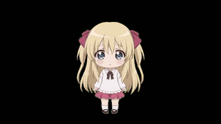

# 岁纳京子桌宠 · dsh-pet-kyoko

《[摇曳百合](https://ja.wikipedia.org/wiki/%E3%82%86%E3%82%8B%E3%82%86%E3%82%8A)》（ゆるゆり）里那位金发粉结的**岁纳京子**——非官方同人桌宠。  
在 [DeepSeek Harness](https://github.com/deepseek-ai/deepseek-harness) 上待机、点她、拖她，可选全局打字时也会跟着闹腾。

<p align="center">
  
</p>

<p align="center"><em>本仓库主角：岁纳京子（同人定妆）</em></p>

> **同人 · 非官方**：角色与原作归原权利方；本仓库是粉丝向技术演示，**禁止商用**。完整说明见 [DISCLAIMER.md](DISCLAIMER.md)。

---

## 京子在干什么

| 待机呼吸 | 点击开心 | 伸个懒腰 |
|:---:|:---:|:---:|
|  |  |  |

| 大口吃零食 | 玩游戏气急败坏 | 被拖起来 |
|:---:|:---:|:---:|
|  |  |  |

成品配置与 webm 在 `kyoko-pack/`；生成用提示词在 `prompts/kyoko/`。

---

## 致谢（写在前面）

这个项目能立得住，靠的是原作与上游开源，不是凭空造出来的。

### 原作《摇曳百合》

感谢 **なもり（Namori）** 老师笔下的岁纳京子，以及《摇曳百合》漫画 / 动画制作、出版与相关权利方。  
京子的性格、造型与「悠闲又麻烦」的气质是本仓库同人桌宠的全部灵感来源；没有原作，就不会有这个项目。  
本仓库仅为粉丝向、非商用技术演示，**不代表官方、不声称授权**。若权利方希望调整或下架素材，请开 Issue，我们会尽快配合。

### 上游桌宠引擎

感谢 [**PC2005-cloud/dsh-pet**](https://github.com/PC2005-cloud/dsh-pet)：插件主体、素材处理链、互动框架等**大部分代码与管线都引用自上游**。  
上游默认角色（蓝发鲸鱼女仆等）是上游作者的作品，值得尊重；**本仓库对外介绍以岁纳京子为主角**，安装后可关掉上游默认宠物、只留京子。  
完整引擎文档、默认动画列表与原 DIY 说明，请直接看上游仓库，勿把上游角色简介误当成京子项目简介。

### 运行时

感谢 [deepseek-ai/deepseek-harness](https://github.com/deepseek-ai/deepseek-harness) 提供桌宠挂载与宿主能力。

---

## 什么是「本仓库做的」，什么是「引用的」

| 内容 | 归属 | 说明 |
|------|------|------|
| `dsh-pet/`、`scripts/`、上游默认动画 / 提示词 | **引用上游** dsh-pet | 代码 MIT；上游素材约定禁止商用 |
| 上游默认角色（鲸鱼女仆等） | **上游作品** | 致谢其作者；**不是**本仓库主角 |
| `kyoko-pack/`、`prompts/kyoko/`、`assets/kyoko-preview/` | **本仓库同人** | 京子提示词、配置、透明动画与预览图 |
| 全局打字互动 | **本仓库改动** | 在上游插件上增加的按键触发 |
| 门面文档 | **本仓库编写** | [NOTICE](NOTICE.md) · [DISCLAIMER](DISCLAIMER.md) · [CHANGES](CHANGES.md) |

相对上游改了什么 → [CHANGES.md](CHANGES.md)

---

## 快速开始（以京子为主角）

### 1. 安装 DSH 与插件

```sh
node -v
npm install -g @deepseek-ai/dsh pnpm
```

从本仓库安装带打字改动的插件：

```sh
git clone https://github.com/yukikazesl/dsh-pet-kyoko.git
cd dsh-pet-kyoko/dsh-pet
npm install
dsh plugin --profile web add file:D:/path/to/dsh-pet-kyoko/dsh-pet
```

也可先装上游 npm 包再只用京子 pack（则**没有**本仓库的打字互动补丁）：

```sh
dsh plugin --profile web add dsh-pet
```

### 2. 启用京子 pack

拷到 DSH 用户目录：

```text
%USERPROFILE%\.dsh\dsh-pet\pet\kyoko-config.json
%USERPROFILE%\.dsh\dsh-pet\pet\kyoko-animation\*.webm
```

源文件在仓库 `kyoko-pack/`。

### 3. 启动

```sh
dsh web
```

设置里可把上游默认宠物的 `display` 设为 `none`，只留京子。京子配置默认 `typingEnabled: true`。

> 兼容性参考上游；本仓库在 dsh `0.1.1-rc.2` 下验证较多。

---

## 目录速览

```text
assets/kyoko-preview/       # README 用的京子定妆与动作预览
kyoko-pack/                 # DSH 用配置 + webm
prompts/kyoko/              # 定妆图、完整提示词
dsh-pet/                    # 上游插件 + 打字等本地改动（引用为主）
scripts/                    # 上游素材链（绿幕 mp4 → 透明 webm）
```

自制新动作：`prompts/kyoko/完整提示词/` → 绿幕 mp4 放 `video/`（默认不入库）→ 跑 `scripts/` → webm 放进 `kyoko-pack/kyoko-animation/` 并改配置。

---

## 许可

- **代码**（含对上游的修改）：MIT，见 [LICENSE](LICENSE)；上游版权见 [NOTICE.md](NOTICE.md)。
- **素材**（上游动画 / 京子同人动画 / 提示词 / 源视频）：可开源学习与个人非商用；**禁止商用**。
- **角色形象**：归《摇曳百合》原作权利方；本仓库不授予任何官方授权。

贡献前请读 [CONTRIBUTING.md](CONTRIBUTING.md)。
